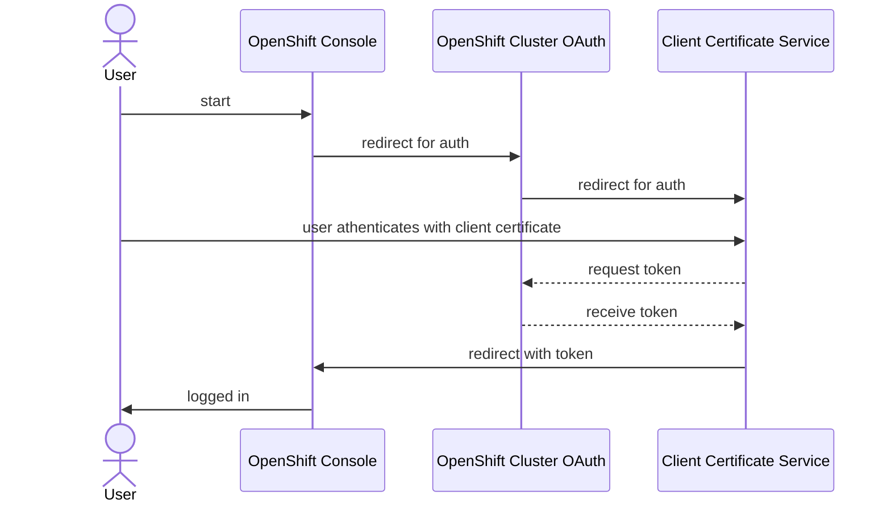

# Client Certificate Authentication for OpenShift

This uses [Request Header authentication](https://docs.openshift.com/container-platform/4.11/authentication/identity_providers/configuring-request-header-identity-provider.html) and extends OpenShift to support TLS client
certificates. Here is the full authentication sequence diagram:



## Required Certificates

We need a number of certificates in order to make this work, lets enumerate all
of them:

| What | Why |
| --- | --- |
| Client Certificate CA Chain | Full CA chain of the issuers for the client certificates that will be verified. |
| Frontend | In order to make a TLS connection, the service needs it's own certificates. |
| Backend | Since we will be proxying authentication traffic at minimum we need a certificate pair that is signed and available to the Client Certificate Service AND is trusted by the OpenShift Cluster OAuth |

### Frontend

These certificates should be signed by an issuer that is generally trusted by
browsers because a user will access the service to perform client certificate
authentication.

### Backend

We need a small PKI infrastructure for the backend service authentication from our client
certificate authentication service to the OpenShift Cluster OAuth service.

> :memo: Note: We are unable to use certificates from the OpenShift Service CA because
> the certificates are not signed to allow for client authentication which is required
> for our backend service.

#### Preferred: Using cert-manager Operator

1. Install cert-manager operator from Operator Catalog in OpenShift Console

2. Configure

```
$ oc apply -k cert-manager/
```

## Deploy the Client Certificate Service

We will use Nginx for doing the work of validating the client certificates but
we could also use any number of other solutions including Apache HTTPd.

Clone this git repository and add the client certificate CA as `ca.pem`

```bash
$ git clone <repo>
$ cd <repo>
$ cp ../ca.pem ca.pem
```

Apply the configuration

```
$ oc apply -k .
```

### Update OpenShift Cluster OAuth Configuration

The OAuth service requires that the backend CA certificate exist in the openshift-config
namespace so copy it over:

```
$ oc get secret ca-secret -o go-template='{{index .data "ca.crt" | base64decode}}' > ca.crt
$ oc create cm client-certificate-auth-ca -n openshift-config --from-file=ca.crt
```

Get the full URL to our client certificate service:

```
$ oc get route
```

Update the OAuth configuration and replace `<route URL>` with that URL

```yaml
apiVersion: config.openshift.io/v1
kind: OAuth
metadata:
  name: cluster
spec:
  identityProviders:
  - name: requestheaderidp
    type: RequestHeader
    requestHeader:
      loginURL: https://<route URL>/login-proxy/oauth/authorize?${query}
      challengeURL: https://<route URL>/challenging-proxy/oauth/authorize?${query}
      headers:
      - X-Remote-User
      ca:
        name: client-certificate-auth-ca
      clientCommonNames: 
      - auth.client-certificate-auth.svc
```

**DONE!**

We have deployed the client certificate service, you should be able to
log into the console and be presented with a request to use mutual TLS.

## Debugging

First look at the Client Certificate Service logs for the auth deployment:

```
$ oc logs -l app.kubernetes.io/name=client-certificate-auth --prefix
```

## Other Configuration

### Frontend TLS Certificates

By default, the service will deploy using the backend certificates for the frontend.
If we have a new certificate and key we need to first go into the client:

```
$ oc project client-certificate-auth
```

1. Remove the service CA annotation

```
$ oc annotate service auth service.beta.openshift.io/serving-cert-secret-name-
```

2. Add the certificate as a secret

```
$ oc create secret tls \
    client-certificate-auth-cert \
    --cert=path/to/server.pem \
    --key=path/to/server-key.pem
```

3. Restart the deployment

```
$ oc rollout restart deploy/client-certificate-auth
```

### Fallback Basic Auth with htpasswd

With this authentication module we cannot use other types of authentication in OpenShift
but we can implement any kind of authentication that is available in our service based
on Nginx. In this example, we can use htpasswd-based authenticaton

1. First create a htpasswd file

```
$ htpasswd -c htpasswd jason
```

2. Create a secret from that htpasswd file

```
$ oc create secret generic \
    client-certificate-auth-htpasswd \
    --from-file=htpasswd=path/to/htpasswd
```

3. Roll out the new configuration

```
$ oc rollout restart deployment/auth
```
